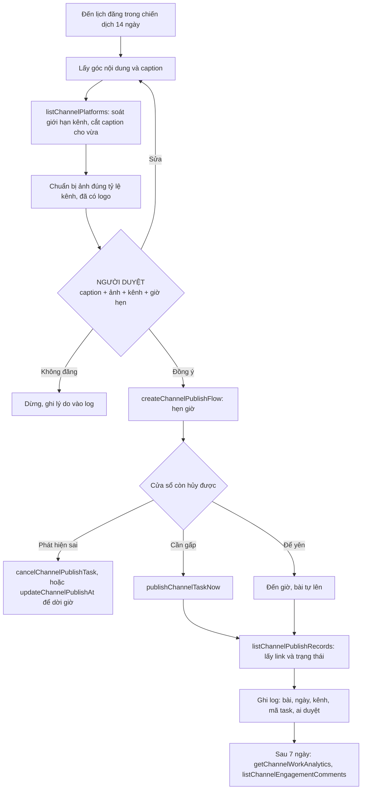

# Luồng post bài · đặc tả từ đầu tới cuối

Đây là luồng đã chạy thật để ra file [../demo/thao-an/assets/images/thao-an-serum-rau-ma-fb-01.png](../demo/thao-an/assets/images/thao-an-serum-rau-ma-fb-01.png). Mở ảnh đó ra xem trước khi đọc tiếp, để biết cuối luồng ra cái gì.

Luồng này nối chiến dịch 14 ngày của buổi 4 với việc đăng bài thật, qua bộ công cụ aitoearn. Sáu bước, một chốt duyệt bắt buộc ở giữa, và một cửa sổ còn hủy được sau khi duyệt.

**Hai điều kiện bắt buộc trước khi chạy luồng này:**

1. Kênh đang nối là **kênh demo hoặc kênh cá nhân**. Không nối fanpage công ty đang chạy thật. Muốn dùng kênh công ty thì làm sau buổi học, sau khi đã xin phép người phụ trách trang.
2. Mặc định là **hẹn giờ đăng**, không phải đăng ngay. Lý do nằm ở mục "Vì sao luôn hẹn giờ" bên dưới.

---

## Sơ đồ luồng



Sơ đồ dạng chữ, dùng khi mermaid không hiển thị được:

```
[Lịch đăng] -> [Caption] -> [Soát giới hạn kênh] -> [Chuẩn bị ảnh]
     -> [NGƯỜI DUYỆT] -> [Hẹn giờ đăng] -> [Cửa sổ hủy] -> [Bài lên] -> [Ghi log]
           ^                                     |
           |______ sửa và quay lại ______________|
           |                                     |
           |                       hủy hoặc dời giờ -> [Sửa, quay lại duyệt]
           |
    không đăng -> [Dừng, ghi lý do]
```

---

## Bảng từng bước

| # | Bước | Ai làm hoặc công cụ nào | Đầu vào | Đầu ra | Điều kiện dừng |
|---|---|---|---|---|---|
| 1 | Lấy góc nội dung và caption | Skill viết bài của buổi 4, đọc file trong thư mục làm việc | `lich-14-ngay.md`, `san-pham-thao-an.md`, giọng văn và từ cấm trong `CLAUDE.md` | Góc nội dung, caption hoàn chỉnh, mô tả ảnh | Caption chứa từ cấm, hoặc chứa thông tin không tra được trong hồ sơ sản phẩm |
| 2 | Soát giới hạn kênh và cắt caption cho vừa | `listChannelPlatforms` | Tên nền tảng định đăng | Giới hạn ký tự, số ảnh, số video, yêu cầu tiêu đề; caption đã cắt riêng cho từng kênh | Kênh chưa nối; hoặc caption vượt giới hạn mà chưa cắt |
| 3 | Chuẩn bị ảnh đúng tỷ lệ kênh | Người chuẩn bị, hoặc công cụ tạo ảnh nếu lớp có | Mô tả ảnh, ảnh chụp thật hoặc ảnh làm ở buổi 4, logo PNG nền trong | Ảnh cuối đã có logo, đúng tỷ lệ, đúng số lượng kênh cho phép | Ảnh sai tỷ lệ; logo đè lên sản phẩm hoặc mặt người; số ảnh vượt giới hạn kênh |
| 4 | **CHỐT NGƯỜI DUYỆT** | **Người, không phải agent** | Caption + ảnh cuối + tên kênh + giờ hẹn đăng | Đồng ý, hoặc yêu cầu sửa, hoặc không đăng | Người duyệt chưa trả lời thì luồng đứng yên, không có ngoại lệ |
| 5 | Tạo luồng đăng, **hẹn giờ** | `createChannelPublishFlow` | Caption đã duyệt, ảnh, tên kênh, giờ hẹn | Một task đã hẹn giờ, có mã task | Kênh mất kết nối; nền tảng từ chối bài |
| 5b | Dời giờ hoặc hủy trong cửa sổ an toàn | `updateChannelPublishAt` để dời, `cancelChannelPublishTask` để hủy | Mã task | Giờ mới, hoặc task đã hủy | Quá giờ đăng thì không hủy được nữa, phải vào tận kênh gỡ tay |
| 5c | Đăng ngay, chỉ khi thật sự gấp | `publishChannelTaskNow` | Mã task đã duyệt | Bài lên ngay | Chỉ dùng sau khi đã duyệt, và người duyệt biết mình đang bỏ một lớp phanh |
| 6 | Lấy link bài và ghi log | `listChannelPublishRecords`, rồi agent ghi vào bảng | Mã task | Link bài, trạng thái đăng, một dòng trong bảng log | Không ghi được thì báo người, không được bỏ qua âm thầm |
| Sau | Sau 7 ngày, đọc số liệu và bình luận. Nằm ngoài luồng, chạy khi làm báo cáo | `getChannelWorkAnalytics`, `listChannelEngagementComments` | Link hoặc mã bài | Số liệu bài, danh sách bình luận | Trả lời bình luận (`submitChannelEngagementComment`) phải qua người duyệt, y hệt đăng bài |

**Công cụ phụ trợ, chạy trước hoặc sau luồng:**

- `listChannelPlatforms`: xem danh sách nền tảng và giới hạn từng kênh. Chạy trước khi soạn caption.
- `listChannelPlatform` hoặc `getChannelPlatform`: xem mình đang nối những kênh nào. Chạy trước khi bắt đầu, để không đăng nhầm kênh.
- `listChannelPublishRecords`: xem lịch sử đăng và các bài đang nằm chờ tới giờ. Chạy trước để tránh trùng bài, chạy sau để lấy link.
- `getChannelAccountAnalytics`: số liệu chung của cả tài khoản, dùng cho báo cáo tuần chứ không dùng trong luồng post.

---

## Vì sao luôn hẹn giờ, không đăng ngay

Đây là điểm dạy mới của buổi 5, và là cách kiểm soát rủi ro thực tế nhất.

Lớp thứ ba của luồng có **hai phanh, không phải một**:

```
XỬ LÝ xong  ->  [PHANH 1: NGƯỜI DUYỆT]  ->  hẹn giờ đăng
                                              |
                                        [PHANH 2: cửa sổ còn hủy được]
                                              |
                                          đến giờ, bài lên
```

- **Phanh 1** là người đọc và đồng ý. Chặn được cái sai nhìn ra ngay.
- **Phanh 2** là khoảng thời gian từ lúc hẹn tới lúc bài lên. Chặn được cái sai chỉ nhìn ra sau khi đã bấm đồng ý: sai tên khách, sai giá, sai chính tả, hoặc đơn giản là đọc lại thấy không ổn.

Trong cửa sổ đó có hai đường xử lý, cả hai đều là một câu lệnh:

- Sai nhẹ, sửa được: `updateChannelPublishAt` dời giờ ra xa, sửa xong hẹn lại.
- Sai nặng, thôi không đăng: `cancelChannelPublishTask` hủy hẳn, rồi ghi lý do vào log.

Đăng ngay bằng `publishChannelTaskNow` thì mất phanh 2. Bài đã lên, hủy không còn tác dụng, phải vào tận kênh gỡ tay, và trong khoảng đó đã có người đọc.

**Luật đề xuất cho lớp:** duyệt xong hẹn tối thiểu 15 phút. Bài trong chiến dịch thì hẹn thẳng khung giờ đăng của ngày hôm sau. Đăng ngay chỉ dùng khi có lý do gấp rõ ràng, và ghi vào cột Ghi chú trong log rằng bài này đăng ngay, vì sao.

---

## Chốt người duyệt nằm ở đâu và duyệt cái gì

**Nằm giữa bước 3 và bước 5.** Không được đặt sớm hơn, vì lúc đó chưa có caption đã cắt vừa kênh và chưa có ảnh cuối để xem. Không được đặt muộn hơn, vì bước 5 đã là đẩy bài vào hàng chờ ra ngoài.

Nói rõ một chuyện hay bị hiểu nhầm: **hẹn giờ cũng tính là gửi ra ngoài.** Agent không được gọi `createChannelPublishFlow` trước khi có câu duyệt, dù nó chỉ hẹn giờ chứ chưa đăng. Duyệt đứng trước tất cả các công cụ đăng.

Người duyệt được xem đúng bốn thứ, cùng lúc, trên một màn hình:

1. **Caption đúng chữ sẽ đăng.** Không phải bản tóm tắt, không phải bản mô tả. Đúng chữ đó, kèm số ký tự và giới hạn của kênh.
2. **Ảnh cuối cùng đã gắn logo.** Không phải ảnh trước khi gắn. Kèm tỷ lệ và số lượng ảnh.
3. **Kênh sẽ đăng.** Tên kênh cụ thể, và phải là kênh demo hoặc kênh cá nhân trong buổi học.
4. **Thời điểm đăng.** Hẹn giờ lúc nào. Nếu là đăng ngay thì phải nói rõ và nói vì sao.

Người duyệt soát sáu câu, mất khoảng 30 giây:

- Caption có từ nào trong danh sách cấm của ngành không?
- Có số liệu, thành phần, công dụng, giá nào không tra được trong hồ sơ sản phẩm không?
- Caption có vượt giới hạn ký tự của kênh không? Kênh này có bắt tiêu đề không, đã có tiêu đề chưa?
- Ảnh có đúng sản phẩm và đúng thông điệp của bài không? Logo có đè lên nội dung chính không? Ảnh có bị cắt mất phần quan trọng theo tỷ lệ kênh không?
- Kênh có đúng không? Có đúng là kênh demo, không phải trang thật của công ty?
- Giờ hẹn có đúng không, và còn đủ cửa sổ để hủy nếu cần không?

Agent được phép tự soát và báo cáo phần này. Nhưng agent tự soát không thay được người đọc. Agent là người báo cáo, người là người duyệt.

Người duyệt có ba lựa chọn: đồng ý, yêu cầu sửa và quay lại bước 1, hoặc không đăng. Chọn không đăng thì vẫn ghi một dòng log kèm lý do, để lần sau biết góc nào hay bị loại.

---

## Bảng ghi log đề xuất

Ghi ngay sau khi đăng. Không ghi thì tuần sau không đo được gì.

| Cột | Kiểu dữ liệu | Dùng để đo cái gì |
|---|---|---|
| Ngày đăng | Ngày | Đối chiếu lịch chiến dịch, biết bài nào trễ |
| Mã bài | Chữ, ví dụ D03 | Tra ngược về chiến dịch 14 ngày |
| Nền tảng | Chọn sẵn | Facebook, TikTok, Instagram, Threads... Nền tảng nào ra kết quả |
| Kênh | Chọn sẵn | Tên kênh cụ thể. Ghi rõ là kênh demo hay kênh thật |
| Góc nội dung | Chữ ngắn | Góc nào ra tương tác, góc nào ra đơn |
| SKU nhắc tới | Chọn sẵn | Sản phẩm nào cần đẩy thêm |
| Số ký tự caption | Số | Đối chiếu giới hạn kênh, biết bài nào suýt bị cắt |
| Link ảnh | Đường dẫn | Dùng lại, hoặc kiểm lại khi có khiếu nại |
| Người duyệt | Tên người | Trách nhiệm rõ, và biết ai đang là nút thắt |
| Giờ duyệt | Giờ | Đo bài nằm chờ duyệt bao lâu |
| Hẹn giờ hay đăng ngay | Chọn sẵn | Đo xem đội có đang bỏ phanh thứ hai không. Đăng ngay nhiều là dấu hiệu xấu |
| Giờ đăng | Giờ | Khung giờ nào tốt |
| Mã task đăng | Chữ | Mã do `createChannelPublishFlow` trả về. Cần để dời giờ hoặc hủy |
| Link bài | Đường dẫn | Lấy bằng `listChannelPublishRecords`. Dùng để vào lấy số liệu |
| Có phải sửa trước khi duyệt không | Có/Không | Tỷ lệ nháp dùng được ngay, đo chất lượng agent |
| Có hủy hoặc dời giờ không | Có/Không, kèm lý do | Đo phanh thứ hai đang cứu được bao nhiêu bài |
| Kết quả sau 7 ngày | Số | Tương tác, inbox, đơn. Lấy bằng `getChannelWorkAnalytics` |
| Ghi chú | Chữ | Lý do không đăng, lý do đăng ngay, hoặc chuyện bất thường |

Bốn con số đáng nhìn nhất sau 2 tuần: bài nằm chờ duyệt trung bình bao lâu; tỷ lệ nháp phải sửa; số bài bị hủy hoặc dời giờ sau khi đã duyệt (đây là số cho thấy phanh thứ hai có tác dụng thật); và góc nội dung nào ra inbox nhiều nhất.

---

## Lỗi hay gặp và cách xử lý

**1. Caption vượt giới hạn ký tự của kênh.**
Biểu hiện: bài viết cho Facebook đem đăng thẳng lên Twitter, nền tảng từ chối hoặc cắt cụt giữa câu.
Xử lý: chạy `listChannelPlatforms` ở bước 2 trước khi soạn. Vài con số hay vấp nhất: Twitter 280 ký tự, Threads 500, Pinterest 800, Douyin và Xiaohongshu 1.000, TikTok và Instagram 2.200, LinkedIn 3.000, YouTube 5.000, Facebook 63.206. Một bài đăng nhiều kênh thì cắt sẵn nhiều bản, đừng dùng chung một caption.

**2. Quên tiêu đề với kênh bắt buộc có tiêu đề.**
Biểu hiện: bài lên YouTube hoặc LinkedIn bị từ chối, hoặc lên với tiêu đề trống trơ.
Xử lý: hỏi `listChannelPlatforms` xem kênh có bắt tiêu đề không và tiêu đề dài tối đa bao nhiêu. YouTube 100 ký tự, LinkedIn 200, Pinterest 100, Douyin chỉ 30, Xiaohongshu chỉ 20. Tiêu đề 20 ký tự là rất ngắn, phải viết riêng chứ không cắt bừa từ caption.

**3. Số ảnh hoặc loại nội dung không hợp kênh.**
Biểu hiện: gửi 8 ảnh lên Twitter (chỉ nhận 4), gửi ảnh lên YouTube (chỉ nhận video), gửi 5 ảnh lên Pinterest (chỉ nhận 1).
Xử lý: soát ở bước 2. Số ảnh tối đa: Pinterest 1, Twitter 4, Xiaohongshu 9, Facebook và Instagram và Threads 10, Douyin 12, LinkedIn 20, TikTok 35. YouTube không nhận ảnh. Mọi nền tảng chỉ nhận 1 video mỗi bài.

**4. Ảnh sai tỷ lệ theo kênh.**
Biểu hiện: ảnh 1:1 đăng lên story bị cắt mất logo, hoặc ảnh dọc lên Facebook bị co lại nhỏ xíu.
Xử lý: khai tỷ lệ ngay ở bước 3, đừng để mặc định. Facebook feed 1:1 hoặc 4:5. Instagram 4:5. Story và Reels 9:16. Cover và ảnh ngang 16:9. Một bài đăng nhiều kênh thì làm nhiều phiên bản ảnh, đừng dùng chung một file.

**5. Đăng nhầm kênh, hoặc nối nhầm trang thật của công ty.**
Biểu hiện: bài B2B giá sỉ lên trang B2C. Nặng hơn: học viên nối luôn fanpage công ty đang chạy vì "tiện, em có sẵn quyền", rồi bài demo lên trang thật.
Xử lý: chạy `listChannelPlatform` hoặc `getChannelPlatform` trước khi bắt đầu, đọc to tên kênh cho khớp. Ghi tên kênh vào phần trình duyệt ở bước 4 để người duyệt nhìn thấy. Trong buổi học chỉ nối kênh demo hoặc kênh cá nhân, không có ngoại lệ. Nối đúng số kênh cần, đừng nối cả loạt trang cho "đủ bộ".

**6. Trùng bài.**
Biểu hiện: bài Ngày 3 đăng hai lần vì luồng chạy lại, hoặc hai người cùng bấm.
Xử lý: mỗi bài một mã cố định, ví dụ D03. Trước khi tạo luồng đăng, agent chạy `listChannelPublishRecords` xem bài đó đã đăng hoặc đã nằm chờ chưa. Có rồi thì dừng và báo, không đăng đè. Chỉ một người có quyền bấm đồng ý cho mỗi bài.

**7. Agent tự đăng khi chưa được duyệt.**
Biểu hiện: bạn hỏi "chuẩn bị bài đi" và nó gọi luôn `publishChannelTaskNow`, hoặc nó lặng lẽ gọi `createChannelPublishFlow` hẹn giờ mà chưa hỏi ai.
Xử lý: viết ràng buộc cứng vào file skill, xem [../demo/buoi-05/skill-automation-orchestrator.md](../demo/buoi-05/skill-automation-orchestrator.md). Ràng buộc phải liệt kê đủ cả hai: công cụ đăng ngay và công cụ tạo luồng hẹn giờ. Trong prompt hàng ngày, luôn tách riêng câu "trình cho tôi duyệt, không gọi bất kỳ công cụ đăng nào, kể cả hẹn giờ".

**8. Hẹn giờ rồi phát hiện sai mà không biết đường xử lý.**
Biểu hiện: bài đã hẹn 8h sáng mai, 10 phút sau thấy sai tên khách, học viên ngồi chờ tới giờ rồi vào gỡ tay.
Xử lý: dạy hai câu lệnh này ngay trong buổi. Sai nhẹ thì `updateChannelPublishAt` dời giờ ra xa, sửa xong hẹn lại. Thôi không đăng thì `cancelChannelPublishTask`, rồi ghi lý do vào log. Nhấn: quá giờ đăng thì không hủy được nữa, phải vào tận kênh gỡ tay.

**9. Đăng ngay vì "cho nhanh", bỏ mất phanh thứ hai.**
Biểu hiện: duyệt xong bấm `publishChannelTaskNow` cho gọn, thành thói quen, rồi một hôm bài sai lên thật.
Xử lý: đặt mặc định là hẹn giờ tối thiểu 15 phút. Ghi cột "Hẹn giờ hay đăng ngay" vào bảng log và nhìn cột đó mỗi tuần. Đăng ngay nhiều là dấu hiệu đội đang chạy ẩu, không phải dấu hiệu đội chạy nhanh.

**10. Logo đè lên nội dung.**
Biểu hiện: logo che mất chai sản phẩm hoặc mặt người.
Xử lý: chừa sẵn khoảng trống ngay khi chuẩn bị ảnh ở bước 3, trước khi đưa vào luồng. Phát hiện ở bước duyệt thì phải quay lại làm ảnh, không sửa chắp vá.

**11. Mất dấu nguồn đơn.**
Biểu hiện: tuần sau có 12 đơn, không biết đơn nào từ bài nào.
Xử lý: mỗi bài mang một dấu riêng. Link có gắn mã bài, hoặc mã ưu đãi riêng theo bài, hoặc câu mở đầu inbox riêng. Ghi dấu đó vào cột Ghi chú trong log ngay lúc đăng, đừng để tuần sau ngồi đoán. Số liệu của bài thì lấy bằng `getChannelWorkAnalytics`, đừng đếm tay.

---

## Ranh giới an toàn

Những việc **tuyệt đối không** để chạy tự động không người duyệt. Không có ngoại lệ, không có "chỉ lần này".

- **Đăng bài ra kênh công khai, kể cả chỉ hẹn giờ.** Mọi bài, mọi kênh, mọi lúc. `createChannelPublishFlow` và `publishChannelTaskNow` đều nằm sau chốt duyệt.
- **Gửi tin nhắn hoặc email cho khách.** Kể cả tin trả lời câu hỏi quen thuộc. Mẫu trả lời duyệt một lần từ trước, người vẫn bấm gửi.
- **Trả lời bình luận công khai.** Agent được **đọc** bình luận bằng `listChannelEngagementComments`, nhưng gửi trả lời bằng `submitChannelEngagementComment` thì phải qua người duyệt. Bình luận nằm dưới bài, ai cũng đọc được.
- **Công bố giá, khuyến mãi, chiết khấu.** Con số sai một chữ số là mất tiền thật.
- **Trả lời khiếu nại hoặc phản ánh về sản phẩm.** Với Thảo An là phản ánh kích ứng da. Ngành nào cũng có loại này, và loại này luôn là việc của người.
- **Xóa hoặc sửa bài đã đăng.** Xóa cũng là một hành động ra ngoài.
- **Nối thêm kênh mới hoặc cấp thêm quyền cho kết nối.** Người làm, người biết đang cấp gì.

Bốn việc agent **được** làm không cần duyệt, vì không ra ngoài và sửa lại được:

- Đọc dữ liệu trong bảng và file của bạn.
- Xem giới hạn nền tảng (`listChannelPlatforms`), xem kênh đang nối, xem lịch sử đăng (`listChannelPublishRecords`).
- Soạn nháp và để vào ô chờ duyệt.
- Ghi log sau khi bài đã đăng, và đọc số liệu bài (`getChannelWorkAnalytics`).

Quy tắc gọn để nhớ: **agent được nghĩ và được soạn, không được gửi.**

---

## Quy định riêng của buổi học

Ba điều này áp trong buổi, không phải khuyến nghị:

1. **Chỉ nối kênh demo hoặc kênh cá nhân.** Tuyệt đối không nối fanpage công ty đang chạy thật. Giảng viên và trợ giảng đi một vòng kiểm tên kênh trên màn hình từng máy trước khi lớp chạy luồng post bài. Muốn dùng kênh công ty thì làm sau buổi, sau khi đã xin phép người phụ trách trang.
2. **Mặc định hẹn giờ, không đăng ngay.** Duyệt xong hẹn tối thiểu 15 phút.
3. **Gỡ quyền sau buổi nếu không dùng tiếp.** Hai chỗ phải gỡ, làm cả hai mới sạch:
   - Trong Claude Desktop: vào Settings, mục Connectors, tìm kết nối aitoearn, bấm ngắt kết nối.
   - Trên chính nền tảng (Facebook, TikTok, LinkedIn...): vào phần ứng dụng đã cấp quyền trong cài đặt tài khoản, gỡ ứng dụng ra. Bước này quan trọng hơn bước trên, vì ngắt ở Claude không thu hồi quyền đã cấp trên nền tảng.

   *Giao diện hai chỗ này có thể đổi theo phiên bản. Giảng viên bấm thử một lượt trước buổi và chụp lại màn hình để chiếu.*

---

CES Global · Creative, Effective, Sustainable
